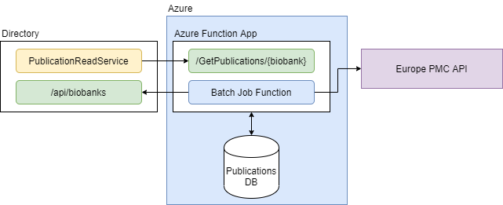
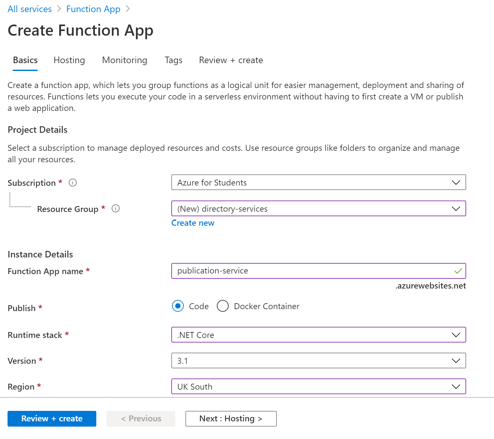
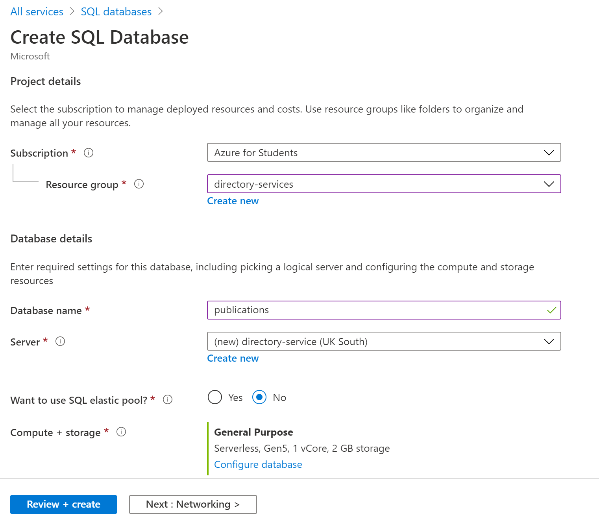
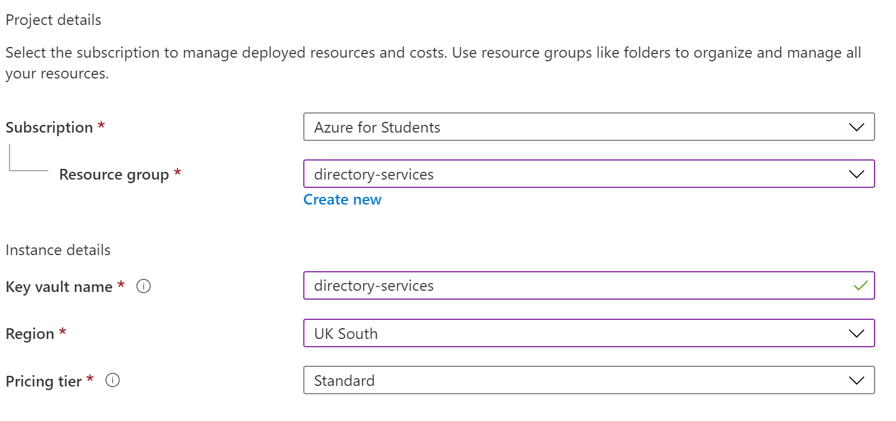
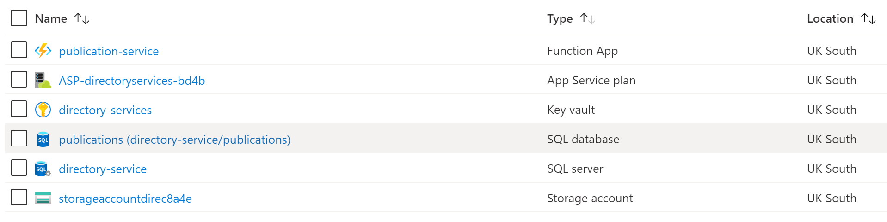
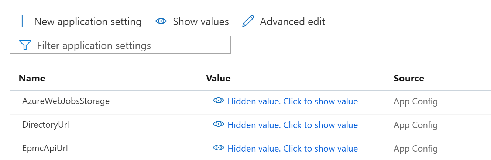
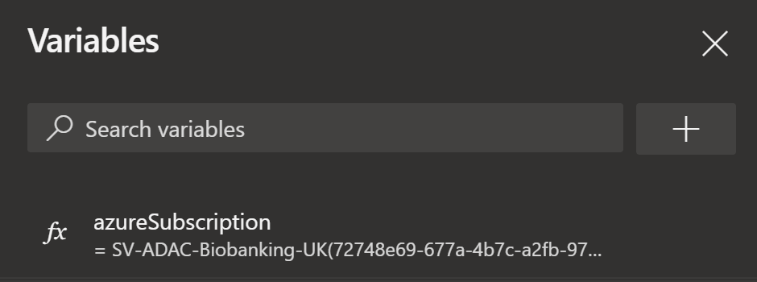

# Publications

## About
The `Publication Service` is an aggregator that queries the [Europe PubMed Central API](https://europepmc.org/RestfulWebService) to find potential articles associated with organizations that are registered on the Directory.

The publication service is utilised by the Directory to gain quick access to potential articles associated to a given Biobank. This functionality can be found in the Publication tab in the Biobank Admin panel (ADAC).

Due to the volume of articles hosted by EPMC, this aggregator hosts its own subset of article metadata, to then be queried by the Directory in real-time.

<p align="center">
  
</p>

Ultimately, the aggregator sites between the Directory and EPMC API - retrieving and caching relevant data.

## Project Structure
The project is broken into two parts. A class library `Publications`, and an Azure Function App service implementation `PublicationsAzureFunctions`. This offers the possiblity to migrate the service to a different platform if required.

The class library contains all the function for the Publication service. This includes service layers to connect to the EPMC API, Directory API and to its own database instance.

The Azure function app is a deployment project that wraps the service layer into two functions. One `Batch` function that excutes daily and one `Endpoint` function that executes on HTTP Trigger.

## Deploying To Azure

The easiest way to deploy to Microsoft Azure is via the included DevOps `publications`. This can be used by linking the respository when creating a new pipeline in DevOps.

Alternatively, the project can be manually built and pushed using [Azure CLI ](https://docs.microsoft.com/en-us/azure/azure-functions/deployment-zip-push). However will require some manual configuration of Azure resources as well.

Before deploying to Azure, the required infrastrucutre must be first created and configured.

## Creating Azure Resources
Setting up Azure resources can be done via the Azure portal or the Azure CLI.

### Resource Group
It is recommended the Directory services are created within their own resource group. This can be created in the Azure Portal from the main page.

### Azure Function App
Next we need create an Azure Function App. It needs to target a `.NET Core 3.1` stack. Name the function app to something sensible and ensure it is part of the created resource group.

<p align="center">
  
</p>

### SQL Database
The service also requires a SQL database to be created. It is highly recommended you use a Severless plan to minimise cost.

<p align="center">
  
</p>

### Key Vault
The service also uses Azure Key Vault to store and share database credentials. This creates a centralized store for the credentials and prevents them being stored in plain text.

<p align="center">
  
</p>

### Final Environment

With all the resources created, you should have a total of 6 resources for 3 services.

<p align="center">
  
</p>

## Configuring Azure Resources

### Key Vault
The Key Vault is used to store the database credentials. These need to be added as Vault `secrets` via the Azure portal with the keys `sqldb-username` and `sqldb-password`.

Key Vault works by authorizing apps and users access. To configure key vault correctly, you must authorize both DevOps `[GET, LIST]` and the Azure Function App `[GET]` with the respective secrets permissions.

<p align="center">
  
</p>

This can be configured under `Access Policy`.

### Azure Function App
The function app uses App Settings to configure the URLs of the apis it relies upon. The App Settings can be updated within the Function App under `Settings > Configuration`.

<p align="center">
  
</p>

The Function App requires the EPMC API URL
```yml
EpmcApiUrl: "https://www.ebi.ac.uk/europepmc/"
```

### DevOps Pipeline

The DevOps pipeline requries setting a series of variables in order to point to the correct resources. Within `pipelines.yml` you should configure:

```yml
variables:
  resourceGroupName: ""
  keyVaultName: ""
  dbServerName: ""
  functionAppName: ""
```

Each resource name can be found via the Azure Portal.

Further, a pipeline variable `azureSubscription` needs to be created in order to link the pipeline to the Azure subscription 

<p align="center">
  
</p>

At this point the pipeline should be ran to build and deploy the service to Azure.

## Testing

Testing requires your Directory having some active, registered Biobanks.

Initally, we should manually trigger the `Batch` function, to populate the database with some articles.

The function can be selected from the Function App from `Functions > Functions` and then manually triggered from `Developer > Code + Test > Test/Run`. Once executed, you should see a sucess message:

```
Executed 'BatchFunction' (Succeeded, Id=, Duration=22986ms)
```

Next we can trigger the `EPMC` function via a HTTP GET request. From the `EPMCFunction` we can grab the endpoint url using `Get Function Url`. Supplying a valid Biobank name, we will get a HTTP 200 response, if the service has an available articles.

```json
[
    {
        "id":123123123,
        "title":"Demo Title",
        "authorString":"James Fleming",
        "journalTitle":"Nature",
        "pubYear":2020,
        "doi":null
    }
]
```
